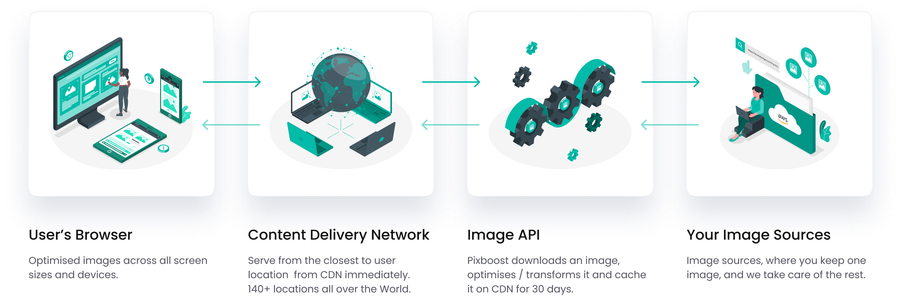

# Overview

[**Pixboost**](https://pixboost.com/) is an Image CDN Cloud Service that resizes and optimises images to reduce file size and therefore improves load time. 

The service works end-2-end and includes 2 main components:

* API - Collection of HTTP endpoints that optimising and transform images
* CDN - Content Delivery Network that stores optimised images in the closest to the user location

Once an image has been processed, it's cached on CDN, increasing the speed at which images can be retrieved on subsequent requests.

Here is the short video on how to use Pixboost API:



In the next chapter, you'll learn how to start using Image CDN in 6 easy to implement steps. 

