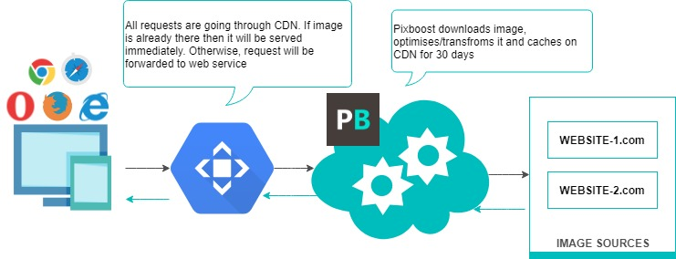
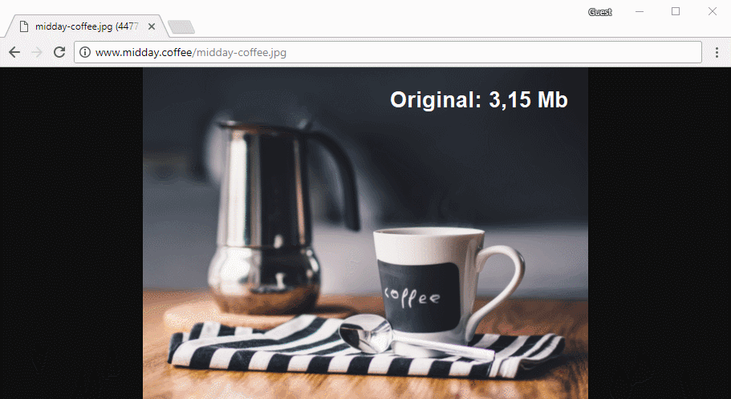

# Overview

[**Pixboost**](https://pixboost.com/) is a Cloud Service that resizes and optimises Raster Images \(e.g. \*.jpg, \*.png, etc\) for file size reduction and decreased Load Times. Once an image has been processed, it's file is cached on CDN, increasing the speed at which images can be retrieved on subsequent requests.

The service can also be used to resize and crop images, which makes generating responsive images that respect the device and screen size on which they are being displayed simple to achieve. Using the service requires modifications to the image URL.

Below is the diagram on Pixboost brief architecture.

Below is a short video that shows image transformations in action:

To start working with the service you would only need to register and [add you image source](setup/adding-image-source.md).

If you have any questions/feedback please do not hesitate to reach us on **customer.service@pixboost.com**. We also have great [FAQ](https://pixboost.com/faq.html) where you might find answers to your questions.

Please, consider the following sources for more information:

## [Quick Start Guide](https://help.pixboost.com/quick-start-10-minutes-or-less.html)

## [Tools and setup](https://help.pixboost.com/setup/)

## [Supported Image Formats](setup/supported-formats.md)

## [API](api/)

## [Pixboost.js Integration](web-dom/)

## [React Integration](react/)

## [API Sandbox](https://pixboost.com/docs/api/)

## [Questions and Answers](https://help.pixboost.com/questions-and-answers.html)

