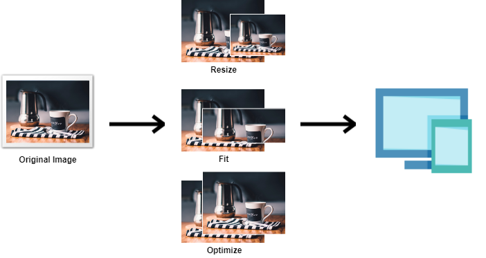

# API. URL-based integration

To make integration easier we came up with URL-based integration. Which means all you need to do is to setup image URL for tags **&lt;img&gt;** and **&lt;picture&gt;** to start using [Pixboost](https://pixboost.com/).

## URL pattern for API call

`https://pixboost.com/api/2/img/[IMAGE_URL|IMAGES_SOURCE_ALIAS_WITH_PATH]/[OPERATION]?[OPERATION_PARAMS]&auth=[API_KEY]`

| Item                                      | Description                                                               |
|:------------------------------------------|:--------------------------------------------------------------------------|
| **\[IMAGE\_URL\]**                        | The URL of the original image you would like to process through Pixboost. |
| **\[IMAGES\_SOURCE\_ALIAS\_WITH\_PATH\]** | An alias of an images source with relative path to the image.             |
| **\[OPERATION\]**                         | Pixboost function call                                                    |
| **\[OPERATION\_PARAMS\]**                 | Pixboost parameters for a function call you are using                     |
| **\[API\_KEY\]**                          | A unique key created by Pixboost for security purposes                    |

### Example using tag **&lt;img&gt;**

Before:

``

After:

``

### Example using tag **&lt;picture&gt;**

Before:

```markup
<picture>
    <source srcset="http://www.midday.coffee/assets/cup.jpeg" 
        media="(min-width: 769px)">
    <source srcset="http://www.midday.coffee/assets/cup.jpeg" 
        media="(max-width: 768px)">
    <source srcset="http://www.midday.coffee/assets/cup.jpeg" 
        media="(max-width: 576px)">
    
</picture>
```

After:

```markup
<picture>
    <source srcset="https://pixboost.com/api/2/img/http://www.midday.coffee/assets/cup.jpeg/optimise?auth=API_KEY" 
        media="(min-width: 769px)">
    <source srcset="https://pixboost.com/api/2/img/http://www.midday.coffee/assets/cup.jpeg/resize?size=300&auth=API_KEY" 
        media="(max-width: 768px)">
    <source srcset="https://pixboost.com/api/2/img/http://www.midday.coffee/assets/cup.jpeg/fit?size=100x100&auth=API_KEY" 
        media="(max-width: 576px)">
    
</picture>
```

We support main resizing transformations that you would need for your website.



Read more on operations:

## [Resize](resize.md)

## [Fit](fit.md)

## [Optimise](optimise.md)

## [As is](as-is.md)

You can explore API sandbox here: [https://pixboost.com/docs/api/](https://pixboost.com/docs/api/)

