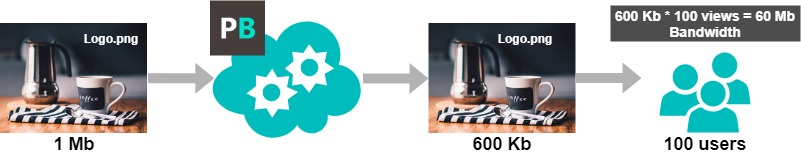

# Billing and Prices

We bill only for the bandwidth. You pay only for what your website uses and nothing more. It’s as simple as ABC.

* Imagine, you have a logo.png image which weights 1MB on your website.
* We compress it to 600KB.
* Let’s pretend that 100 users saw the page.
* So, the calculation would be: 600KB \* 100 views = 60 MB of billed bandwidth.

|  | FREE | Startup | Business | Advanced | ENTERPRISE | Open Source |
| :--- | :--- | :--- | :--- | :--- | :--- | :--- |
| **Pricing** | $0 | $5/month | $25/month | $80/month | Custom pricing | $0 |
| **Bandwidth** | 2GB | 10GB | 50GB | 200GB | Unlimited | Not Supported |
| **Image Processing** | Unlimited | Unlimited | Unlimited | Unlimited | Unlimited | Full functionality |
| **Billining Period** | Not Billed | Monthly | Monthly | Monthly | Monthly / Annualy | Not Billed |
| **CDN** | Supported | Supported | Supported | Supported | Supported | Not Supported |
| **Custom Domain Name** | Supported | Supported | Supported | Supported | Supported | Not Supported |
| **SLA** | Not Supported | Supported | Supported | Supported | Supported | SLA Not Supported |
| **Automated API Workflow Calls** | 10 | 100 | 200 | 500 | Unlimited | Not Supported |
| **Integration Support** | Contact Us | Free | Free | Free | Free | Contact Us |
| **Issues Support** | 1-3 Days | 5-8 Hours | 3-5 Hours | 1-3 Hours | 24/7 Monitoring | By using Github issues |

* `1GB = 1024 * 1024 * 1024 Bytes`

If you are looking into **more than 200 GB per month**, please contact us directly because you are eligible for a special offer:

* Integration Support
* Discounted prices depending on your traffic volume
* 24/7 Support

## Limitations

Maximum image file size - 10 MB

10 API Keys limit\*

10 Image Sources \(domains\) limit\*

\*If you need more API Keys of Image Sources please contact us directly and we will add more for your account.

