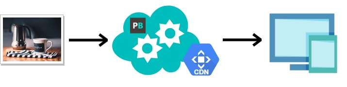
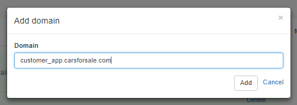
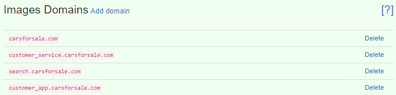
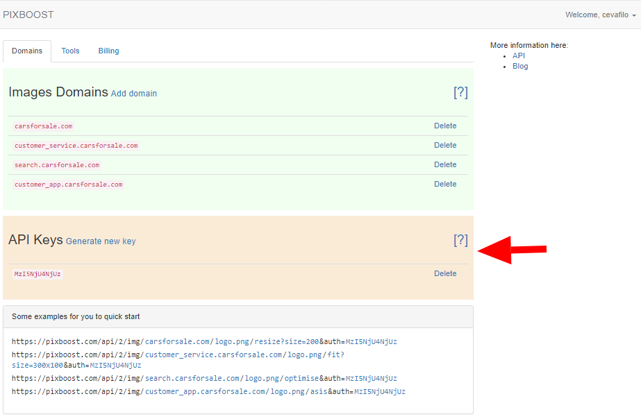
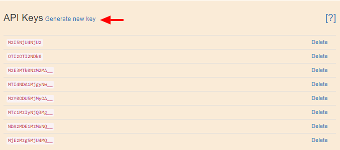
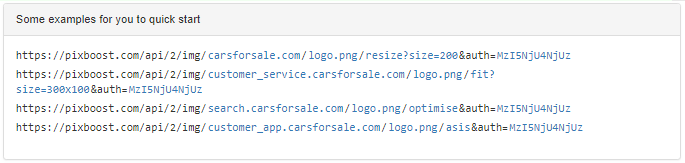

# Quick Start \(10 minutes or less\)

We try to make the start with Pixboost as fast and as easy as possible. We aim it to be under 10 minutes. So, lets cut it short.

Basically, you have to pass your image through the service.

## Step 1

Go to the main page: [https://pixboost.com/](https://pixboost.com/). Enter your email, the one your account would be associated with, into the "**E-mail address**" field. Then press the "**Sign Up**" button.

Or select a plan in the "**Prices**" section and press the "**Sign Up**" button accordingly.

Enter the desired e-mail, the one your account would be associated with, to the field "**E-mail address**" and press the "**Sign Up**" button.

## **Step 2**

Go to your Mailbox, and Press the link to your new account.You will be forwarder to the password setup page.

> We recommend you to create a longer and therefore safer password as your account will contain sensitive financial information.

Please, read our Terms of Service and Privacy Policy thoroughly then tick the box ToC and Privacy Policy.

> By ticking the ToC and Privacy Policy box you agreeing to Pixboost Terms and Conditions and Privacy Policy.

Press the "**Set Password**" button and you will be forwarded to your account.

## **Step 3**

Add at least one _**Image Domain**_ you are going to work with by pressing the "**+**" button on a Welcome Screen.

> _**Image Domain**_ is a domain name of a website you want to connect to Pixboost service. We need this name to establish connection of the name of your website with the API Keys which we generate for security reasons.

Then add your _**Image Domain**_ to the form and press "**Add**" button:

You can add as much domains and sub-domains as you need by clicking "**Add domain**" link. To delete any domains you do not need please press the "**Delete**" link.

## **Step 4**

Below you will see a pre-generated _**API Keys**_, which you will use to generate more API Keys if needed.

> _**API Key**_ is a value that is generated for security purposes by Pixboost. You have to use it in the URLs of images you wish to deliver through Pixboost service.

You might need more then one key in your project. Please read the manual on **API Keys Usage and Security Issues**.

To add more keys please press the link "**Generate new key**":

## **Step 5**

_**Image URL**_ pattern is:

`https://pixboost.com/api/2/img/[IMAGE URL]/[OPERATION]?auth=[API_KEY]&[OPERATION_PARAMS]`

Set up your _**Image URL**_ the following way:

[`https://pixboost.com/api/2/img/mywebsite.com.au/logo.png/resize?size=200&auth=MjczNjAyMjY3NQ__`](https://pixboost.com/api/2/img/mywebsite.com.au/logo.png/resize?size=200&auth=MjczNjAyMjY3NQ__)

Let's look through the parameters of this URL:

[`https://pixboost.com/api/2/img/`](https://pixboost.com/api/2/img/)- calling Pixboost service

`mywebsite.com.au/logo.png/`- URL to the image you would like to process through Pixboost

`resize?size=200&` - function call with parameters, where resize is the resize function you wish to use, and size=200 is a value you wish to set for your image.

`auth=MjczNjAyMjY3NQ__` - is an API key that Pixboost generates for you.

Basic API operations are:

* **Resize** - resize to the needed size with preserving aspect ratio

  `https://pixboost.com/api/2/img/https://yourdomain.com/img.png/resize?size=240&auth=API_KEY`

* **Fit** - resize to the exactly specified size ignoring aspect ratio. Will crop image if needed.

  `https://pixboost.com/api/2/img/https://yourdomain.com/img.png/fit?size=300x200&auth=API_KEY`

* **Optimise** - optimising image

  `https://pixboost.com/api/2/img/https://yourdomain.com/img.png/optimise?auth=API_KEY`

* **As is** - do not perform any transformations

  `https://pixboost.com/api/2/img/https://yourdomain.com/img.png/asis?auth=API_KEY`

Please, refer to the samples in the bottom of the page:

For more information on API, please read the [Images API section](api/).

## **Step 6**

Update all the **Image URLs** on your website that you wish to process through Pixboost according to the **Step 5** and [Image API](api/) instructions.

Apart from URL-based transformations we provide [pixboost.js](web-dom/) and [pixboost-react](react/) libraries for more complex integration cases. For more information please check our integration documentation [here](web-dom/).

