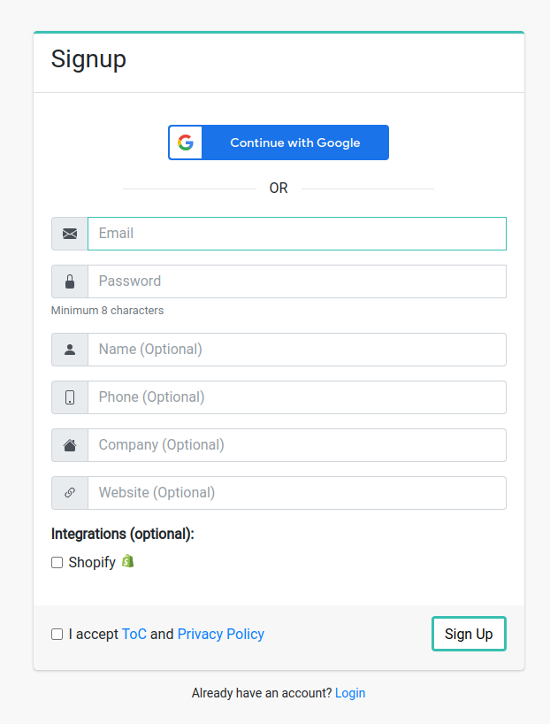
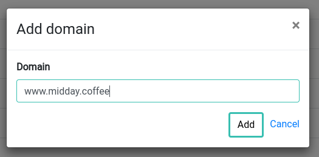
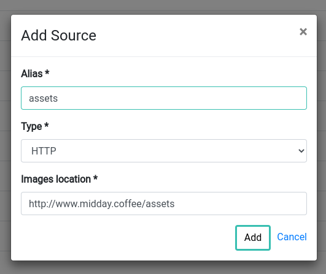
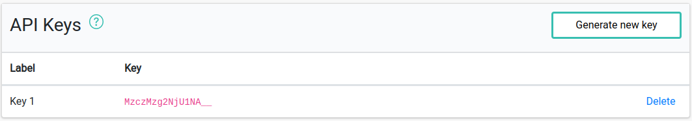
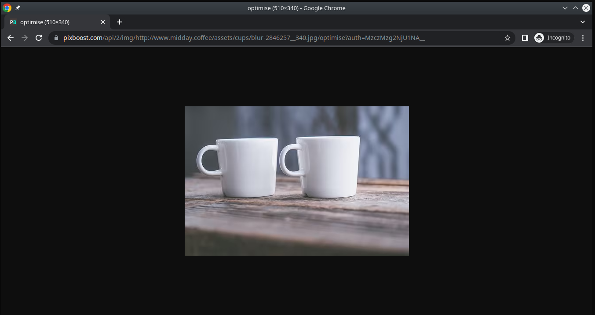
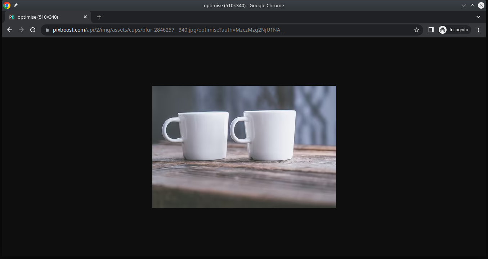
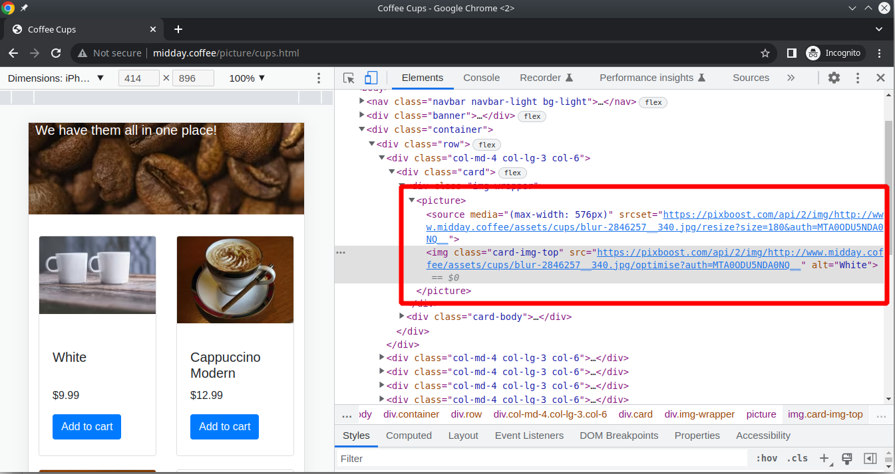

# Quick Start in 5 minutes

We try to make the start with Pixboost as fast and as easy as possible. We aim it to be under 10 minutes. So, lets cut it short.

The main goal is to setup images on your websites to be served through the Pixboost.

## Step 1 - Signup

[Signup](https://pixboost.com/customer/#/signup) using your Google account or by filling in the details.

If you decided to go with Email/Password then you'll receive a confirmation email shortly after
submitting the form.

## Step 2 - Setup source images

Add at least one **Image Domain** or **Image Source**. This will let the service know where the destination
of you source (original) images.

Image source is preferred way, because your image URLs will be shorter when using in the HTML markup. However,
Image Domain is easier to setup.

* For Image Domain simply click `+` button and fill in the domain name

* To create HTTP Image Source click on `bucket` button

## Step 3 - API key

Once you added a domain or source you will see the Dashboard main view. We have already generated an API
key for you, so you can start optimise your images.

## Step 4 - Call API

Use API to optimise or resize the image from your website. You can use Chrome
to call the API

* If you used domain in the [Step 2](#step-2) then your URL would look like

`https://pixboost.com/api/2/img/[SOURCE IMAGE URL]/[OPERATION]?auth=[API KEY]&[OPERATION OPTIONS]`

* If you used HTTP (or other) image source

`https://pixboost.com/api/2/img/[SOURCE ALIAS]/[RELATIVE TO ALIAS PATH]/[OPERATION]?auth=[API KEY]&[OPERATION OPTIONS]`

## Step 5 - Optimise the image on the website

Update image URL in the markup of your website

## What's next

* Learn more on how tou use Pixboost [API](./api/README.md)
* Managing [API keys](./setup/manage-api-keys.md)
* Setup [custom domain name](./setup/custom-domain.md)
 

