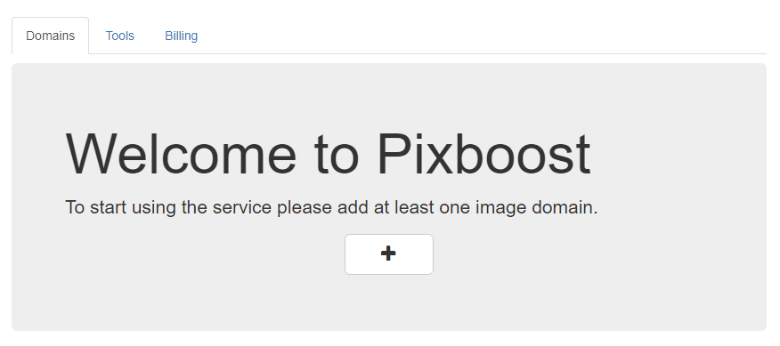
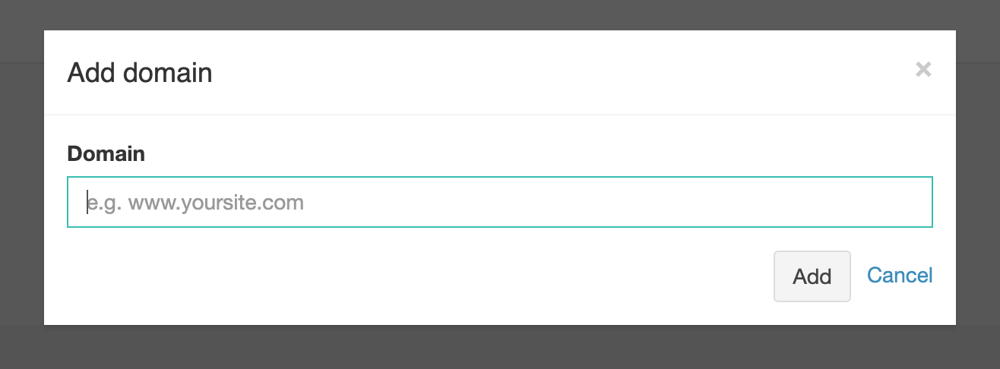
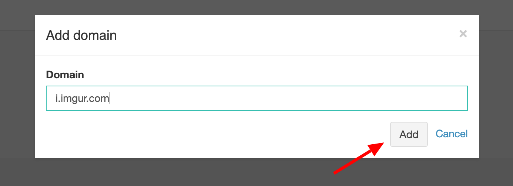
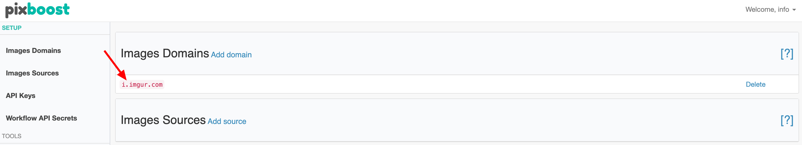

# Adding Image Source

**Image source** is the URL of your server where your images are stored. Pixboost will allow only requests to the images from domains that are listed. Using whitelists allow us to keep service secure for you.

When you login for the first time then you will see a "Welcome" banner:Click on the "Plus" button and you will have to add your domain name in a dialog window "Add domain":



Enter your domain and click the "Add" button:



You will see adeed domain in the list now:

That's enough to start using the service. You can copy an example from the bottom section and try it by replacing "logo.png" with existing image. Just paste it in your browser:

```text
https://pixboost.com/api/2/img/http://i.imgur.com/RgSMqlKg.jpg/resize?size=200&auth=MzI0NTc5NDAyMQ__
```

_You might also need to change protocol in the URL from http:// to https:// if your images are not accessable by HTTP._

