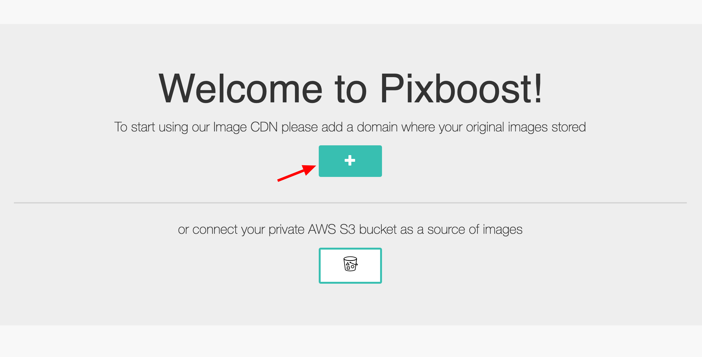

# Adding Images Domain

**Image domain** is the domain name of your server where your images are stored. Pixboost will allow only requests to the images from domains that are listed. Using list of domains allows us to make service secure and protect you account from malicious abuse.

When you login for the first time then you will see a "Welcome" banner:



Click on the "Plus" button and you will have to add your domain name in a dialog window "Add domain":



If you'd like to load images from a private AWS S3 bucket then click on the "Bucket" icon and follow [steps from here](adding-s3-bucket-image-source.md)


Enter your domain and click the "Add" button:


You will see adeed domain in the list now:


That's enough to start using the service. Try it out it in your browser:

```text
https://pixboost.com/api/2/img/http://i.imgur.com/RgSMqlKg.jpg/resize?size=200&auth=MzI0NTc5NDAyMQ__
```

