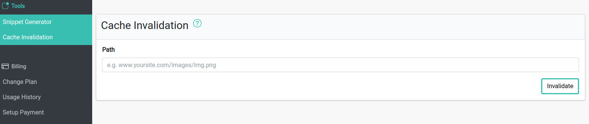

# Cache Invalidation

Cache invalidation is a function that helps you to remove image from the CDN.

You can delete images using either 

* URL of the original image
* Path to the image that starts with the [Image Source](./adding-http-image-source.md) alias 

## Limitations

Invalidation is intended for use in exceptional circumstances, not as part of your normal workflow. Invalidations don't affect cached copies in web browser caches or caches operated by third-party internet service providers.

Invalidations are rate-limited. You can submit at most one invalidation per minute.
