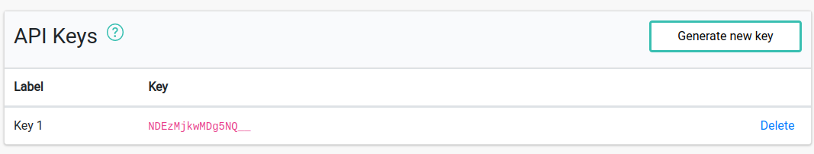

# Managing API Keys

**API Key** is a string that is used to access API and identify requests to your Pixboost account. API Keys are globally unique.

Once you signed up you have one API key that you can see in the dashboard:

## Usage

You'll need to pass an API Key in a query parameter called "**auth**" in the transformation URL. For example:

To use the API key add it as a value in the "auth" query parameter when using API:

https://pixboost.com/api/2/img/pixabay.com/logo.png/resize?size=200&auth=MTg4MjMxMzM3MA

> Be careful when **deleting** API keys. Any API requests that use deleted keys will be failing.

## Labels

You can create new API Keys from the dashboard and add a label to them, so you remember what you use each key for. Labels are only used for information and reporting purposes.

Some useful examples of the label could include a website and environment. For instance:

* dev
* test-site-1
* prod-site-2

## Security

API keys are not secrets and are shared publicly when used to access API. 

When passing an API key with a request, the service can link the request to an account, therefore limiting
the source image destination to image sources/domains you specified.

## Limits

There is a soft limit of 10 API keys per account. If you need more - please contact [support](mailto:customer.service@pixboost.com).
