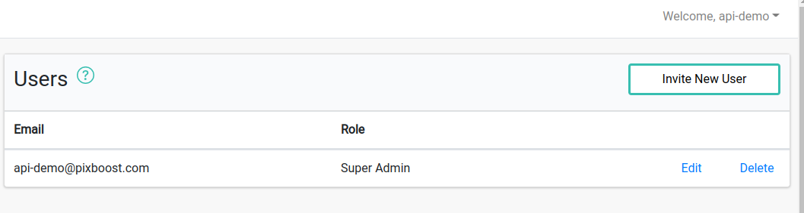
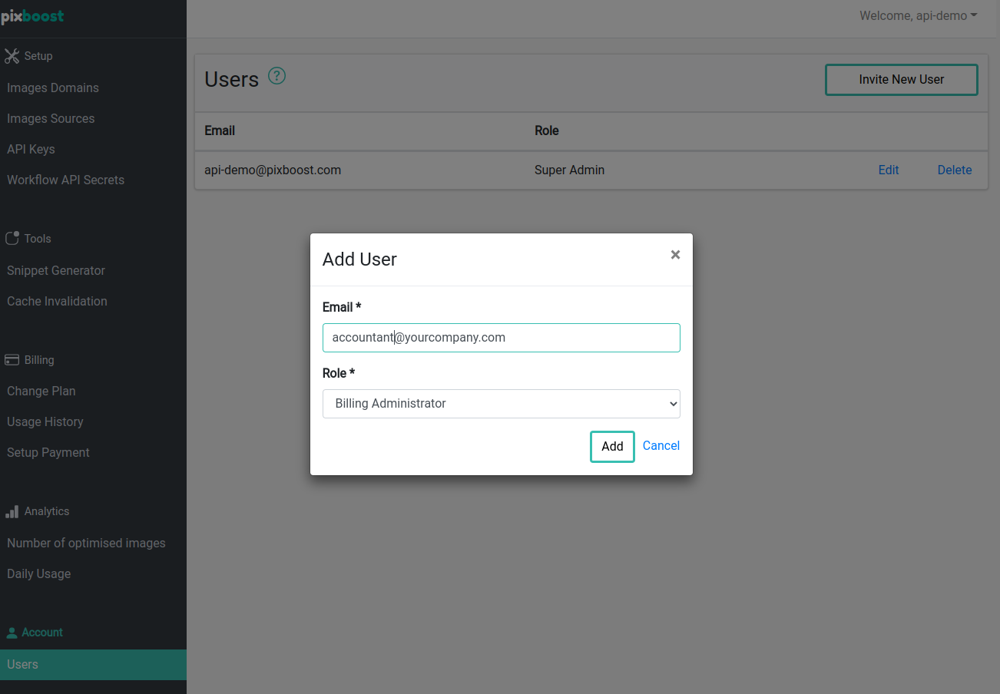

# Managing Users

You can have multiple users in one Pixboost account. That enables you to minimize the risk of loosing
access to the account and do not rely on one login.

Moreover, you can set up the permissions of each user using predefined roles.
Currently, there are three roles you can pick from:

* Super Admin - have full access to the account. Only Super Admin can manage users
* Web Developer - have access to image CDN setup including image sources, API keys, secrets, and analytics
* Billing Admin - have access to payment methods, billing, and analytics

## Adding a new User

* Login to the dashboard and go to the "Users" menu item under the "Account" section

* Click on the "Invite New User" button
* Fill in the Email and pick a role

* Click the "Add" button
* User will receive an invitation email shortly after that with the setup link

## Good practices

It's usually a good practice to have at least 2 Super Admins, so there is no dependency
on a single person/mailbox.

Giving the finance department access using a "Billing Admin" role could help them monitor spending,
and update payment details in time without the involvement of the IT department.

## Limitations

The maximum number of users in the account is set by your current plan and can be looked up
on the ["Prices" page](https://pixboost.com/prices/).

Every account must have at least one "Super Admin" user.

