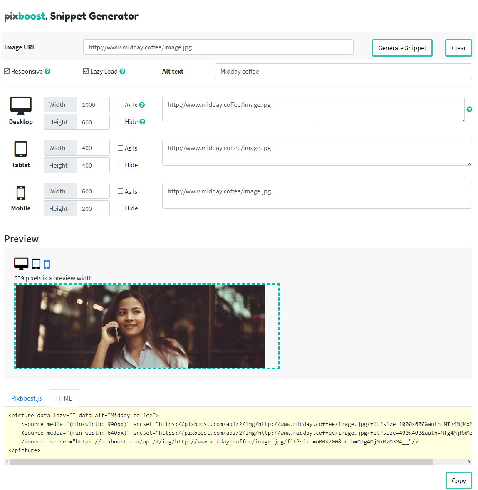
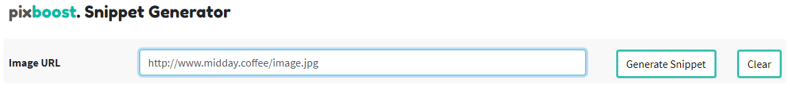
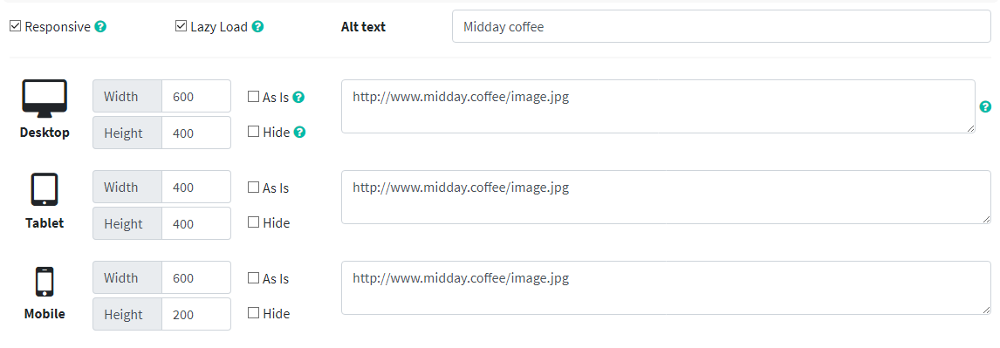
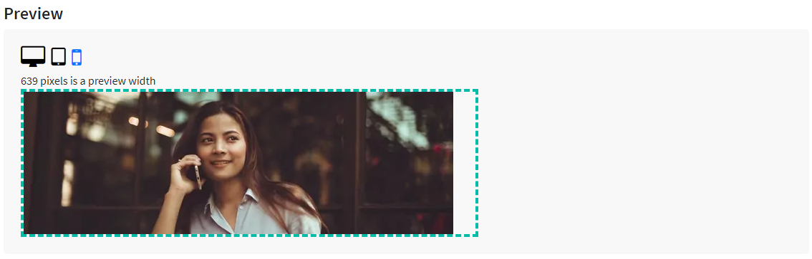
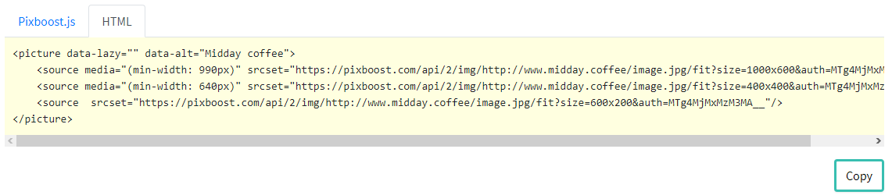

# Snippet Generator

**Snippet Generator** is a Tool that helps users to quick start with Pixboost and to make the setup much easier. It creates the small blocks of reusable code to insert in a code of a website. It is available for all registered users of our service.To start using Pixboost all you need is to modify the URLs of images that you would like to pass through the service for optimization for scaling purposes. That's exactly what Snippet Generator will do for you.

## How to use it from a sandbox or from the app

To start using Snippet Generator you have to options. You either use our sandbox to check it out or you log in to your Pixboost account and there you can use this tool for your projects.

For sandbox the [Start Snippet Generator](https://pixboost.com/snippet/?k=MTg4MjMxMzM3MA__)

* You have to have a URL to the image you would like to compress, scale and deliver through CDN. Or you can use our pre-set images to see how this tool works. Pre-Set sandbox Image URL: [http://www.midday.coffee/image.jpg](https://l.facebook.com/l.php?u=http%3A%2F%2Fwww.midday.coffee%2Fimage.jpg&h=AT0qGqfh1sqliyvsz48vGTCD2PWEVMtywKrZIX6eqHvv7_p3ncit1EZvz5MBOt0Go0MYQ8cK0UKXZVgko_SzsijUK4FhuDvQhzwtxId4jOZX-Gezzzw4OpoIIQurRVdZp3Xplg)
* You have to have an API Key, which we generate for security purposes. You can use this temporary key to test the app: MTg4MjMxMzM3MA\_\_

As a sandbox user or as a registered user you use Snippet Generator in a similar way:

* Press **Generate** button to generate a snippet.

* Select **Responsive** or **static** setting. In a responsive setting you can set sizes for each type of the device you would like to support; computer, tablet or mobile.
* Select **Lazy Loading** option if you would like to turn on lazy loading for your image.
* Enter **ALT Text** for the image. This text will show up in the code of your snippet.
* Set up an image for each of the devices in the following way:  
  1. Input **weight** and/or **height** according to your website needs. These options are available if the **as-is** setting or **hide** setting are not activated  
  2. Select the **As-is** setting if you would like to leave your image as it is. This option would be helpful if you want to deliver an image through CDN without changing it. Other settings will be deactivated.  
  3. Select the **Hide** setting if you would like to hide this image on this type of device. Other settings will be deactivated.

  

* You can preview your images for devices and make changes if needed.

* Finally, after you are happy with your setup, you can **Copy** snippet and paste directly into your website code.

## 

If you think that this tool can be improved please don’t hesitate to tell us in what way we can improve it and make it more useful for you.

