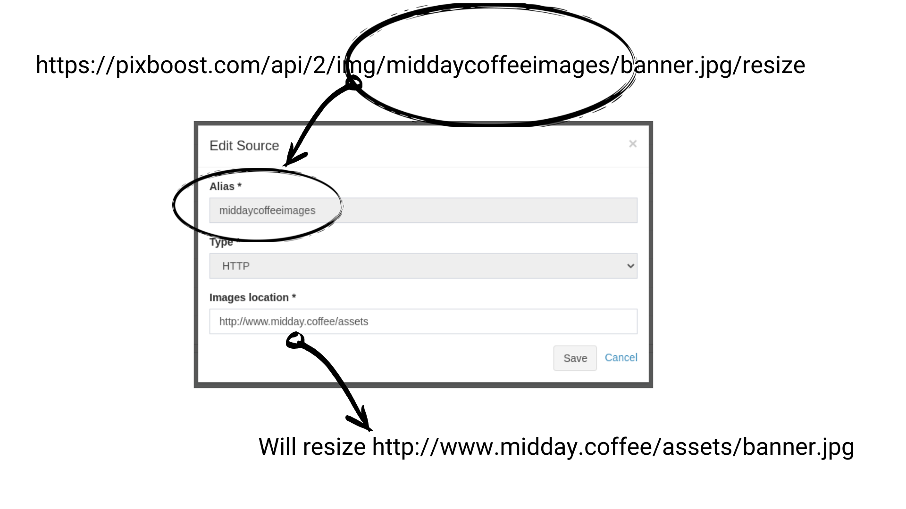
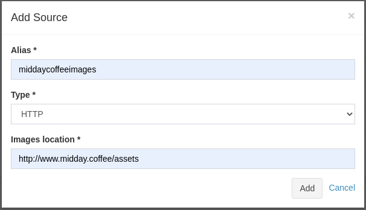
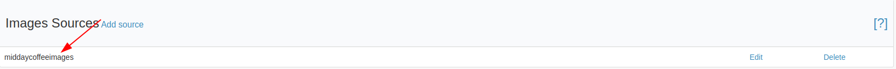

# Adding HTTP Image Source

You could add HTTP image source to shorten URLs that you are using for the integration. 

## Adding a new source

* [Login](https://pixboost.com/customer/#login) to your Pixboost account.
* Click on "Add source" link under the "Images Sources" panel

* In the appeared form set Type to "HTTP" and fill in the details
    * _Alias_ is a unique identifier of the images source that will be used in the URL when calling API
    * _Images location_ is a URL where the original images stored

* Click on "Add" button and verify that the source has been created

