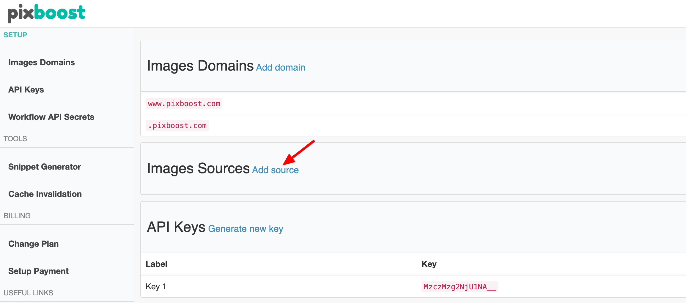
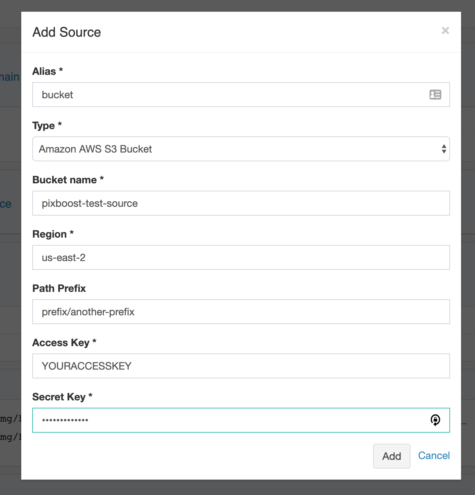
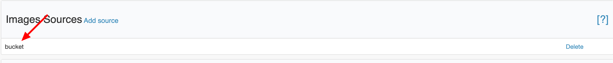

# Adding AWS S3 Bucket Image Source

Using Pixboost, you can set up a private S3 bucket to be a source of your images. Here, we will go through requirements for the S3 bucket, how to add an integration to Pixboost and how to optimise images from the bucket using API.

## AWS setup

We assume that you already have S3 bucket with your images stored there. If not then you can read how to do that [here](https://docs.aws.amazon.com/AmazonS3/latest/user-guide/create-bucket.html).

To setup a new user that you'll integrate with Pixboost:

* Create a new [IAM user](https://docs.aws.amazon.com/IAM/latest/UserGuide/id_users_create.html)
* [Add new credentials](https://docs.aws.amazon.com/IAM/latest/UserGuide/id_credentials_access-keys.html) for the user.
* [Update or create bucket policy](https://docs.aws.amazon.com/AmazonS3/latest/user-guide/add-bucket-policy.html) and give the user s3:ListBucket and s3:GetObject permissions.

Below is an example of a bucket policy:

```javascript
{
    "Version": "2012-10-17",
    "Statement": [
        {
            "Effect": "Allow",
            "Principal": {
                "AWS": "arn:aws:iam::<ACCOUNT_ID>:user/<USER_ID>"
            },
            "Action": "s3:ListBucket",
            "Resource": "arn:aws:s3:::<BUCKET_NAME>"
        },
        {
            "Effect": "Allow",
            "Principal": {
                "AWS": "arn:aws:iam::<ACCOUNT_ID>:user/<USER_ID>"
            },
            "Action": "s3:GetObject",
            "Resource": "arn:aws:s3:::<BUCKET_NAME>/*"
        }
    ]
}
```

## Pixboost setup

To set up the integration:

* [Login](https://pixboost.com/customer/#login) to your Pixboost account.
* Click on "Add source" link under the "Images Sources" panel



* In the appeared form set Type to "Amazon AWS S3 Bucket" and fill in the details
  * _Alias_ is a unique identifier of the images source that will be used in the URL when calling API
  * _Bucket name_ is the name of a bucket
  * _Region_ is an AWS region ID of the bucket
  * _Path Prefix_ is an optional prefix that will be used for all requests. It could be used if all your images in 

    the bucket stored in one folder. In that case, you could set "Path prefix", and you won't need to add it to each API call. 

  * _Access Key_ is an AWS IAM user's access key created in the step above
  * _Secret Key_ is an AWS IAM user's secret key created in the step above



* Click on "Add" button and verify that the source has been created



## Using API

All API requests follow the [original pattern](../api/):

`https://pixboost.com/api/2/img/[ALIAS]/[PATH_TO_THE_IMAGE]/[OPERATION]?[OPERATION_PARAMS]&auth=[API_KEY]`

Let's consider a configuration from the step above. For instance, if there is an image in S3 bucket with a path \(key\): `prefix/another-prefix/images/hello.png` then to resize it we use the following API call:

`https://pixboost.com/api/2/img/bucket/images/hello.png/resize?size=200&auth=[API_KEY]`

In the example above `/bucket` \(after `/api/2/img`\) will be replaced with bucket name and path prefix - `pixboost-test-source/prefix/another-prefix`

## Limitations

You could have a maximum of 10 images sources. That is a soft limit, so if you'd like to raise it, please email us at customer.service@pixboost.com

