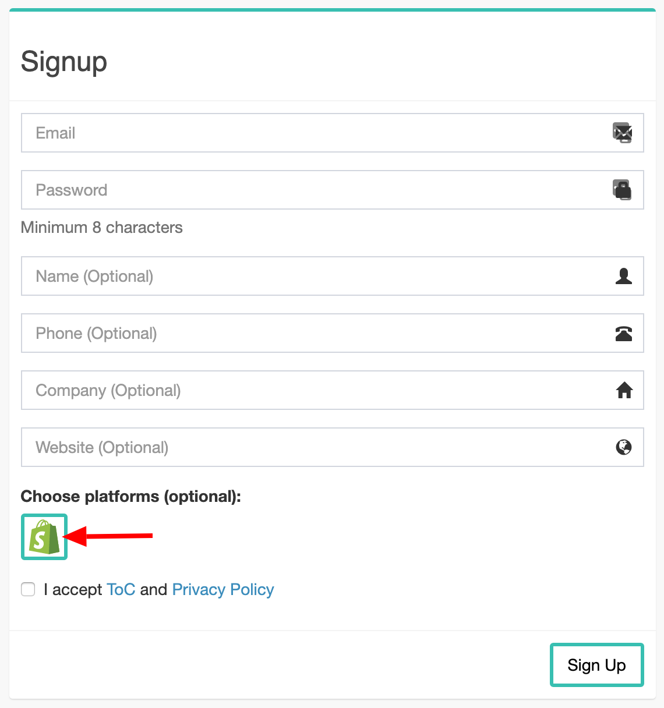

# Shopify Integration

You can use Pixboost Image CDN on your Shopify by:

* Using one of our [themes](shopify.md#themes). No coding skills required.
* [Integrate your custom theme with Pixboost](shopify.md#integration-with-a-custom-theme).

## Themes

We integrated Pixboost with below themes:

* [Debut](https://github.com/Pixboost/shopify-wroom-wroom-debut)

Please, follow steps from ["Installation"](shopify.md#installation) section to use them on your store.

## Installation

* Follow the theme link from the [Themes](shopify.md#themes) section
* Go to "Releases" page and download a zip archive with the latest release

* Open your Shopify store dashboard and go to the "Themes" section

* Click on "Upload theme" button and select the zip archive that you downloaded before

* An uploaded theme should appear on the list

At this point, you should be able to preview the theme, 
and it will use Pixboost demo account. All the images will be served from 
Pixboost Image CDN. Note that first time the images will load slowly as 
they will go through optimisation and CDN uploading process. 
Reload the page after the initial load to see the real performance.

Once you are happy with the result, you would need to create a Pixboost account 
and use your API key:

* [Sign up here](https://github.com/Pixboost/docs/tree/f5010c234fd24fe5e3402831d8152bbad3b3c3ea/shopify/pixboost.com/customer/README.md#/signup) and select Shopify integration

* Confirm your email and copy your API key from the dashboard

* Go back to your Shopify store and click on "Customize" button on the uploaded theme

* Open "Theme Settings" tab and go to "Pixboost" section

* Paste or enter your API key

* Click "Save" button and preview the theme to make sure that images are working

Congratulation! You now have responsive, optimised and fast images on your 
Shopify store. Keep customizing your page layouts and publish the theme once
you are ready.

## Integration with a custom theme

To integrate your theme with Pixboost requires modifications in the code of the theme. Please, do not hesitate to reach us on [customer.service@pixboost.com](mailto:customer.service@pixboost.com), so we can help you with integration.

We tried to make the process easy and wrote [a step by step guide](https://medium.com/pixboost/boosting-image-performance-of-your-shopify-store-d3696ac71f93?source=pixboost-help)

