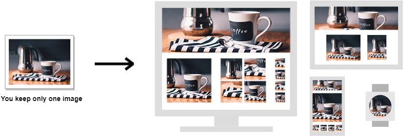

# Responsive Images



Library replaces all elements that have `data-pb-picture` attribute with `<picture>` tag.  
Picture tag will include different sources \(images\) for different CSS breakpoints \(screen sizes\).

For instance, for the element:

```markup
<div data-pb-picture
    data-lg="optimise"
    data-lg-url="https://yoursite.com/doggy.png"
    data-md="resize?size=300"
    data-md-url="https://yoursite.com/doggy.png"
    data-sm="fit?size=100x100"
    data-sm-url="https://yoursite.com/doggy.png"/>
```

when you run picture\(\) function from the library:

```javascript
    window.Pixboost.picture({apiKey: 'API_KEY'})
```

then `div` will be replaced with `<picture>` tag:

```markup
<picture>
    <source srcset="https://pixboost.com/api/2/img/https://yoursite.com/doggy.png/optimise?auth=API_KEY" 
        media="(min-width: 990px)">
    <source srcset="https://pixboost.com/api/2/img/https://yoursite.com/doggy.png/resize?size=300&auth=API_KEY" 
        media="(min-width: 640px)">
    
</picture>
```

## Operations

Operations \(`data-<BREAKPOINT>` attribute\):

* optimise
* resize
* fit
* asis
* hide

You can specify operation arguments by adding them after operation name, e.g. `fit?size=100x100`

See more about operations [here](https://pixboost.com/docs/api/).

If you have the same source image for all operations then you can specify default URL:

```markup
<div data-pb-picture
    data-url="https://yoursite.com/doggy.png"
    data-lg="optimise"
    data-md="resize?size=300"
    data-sm="fit?size=100x100"/>
```

## Alt text

You can specify alt text for responsive images using `data-alt` attribute:

```markup
<div data-pb-picture
    data-alt="doggy"
    data-url="https://yoursite.com/doggy.png"
    data-lg="optimise"
    data-md="resize?size=300"
    data-sm="fit?size=100x100"/>
```

## Supporting Breakpoints

* _lg_ - Large devices \(desktops, 990px and up\) `@media (min-width: 990px)`
* _md_ - Medium devices \(tablets, 640px and up\) `@media (min-width: 640px)`
* _sm_ - Small devices - everything below tablets

