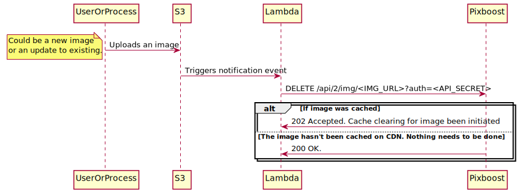

# Automated Workflows

Workflows help you to automate certain tasks while managing your images using Pixboost service.
Workflows consist of API endpoints that you could use from your applications. Currently, Pixboost supports
only one workflow endpoint:

* [Cache Invalidation](cache-invalidation.md)

To call a workflow API, you will need to create an API secret first. Please, read about creating and managing 
API secrets [here](api-secrets.md).

Example of the workflow could be a CDN cache invalidation in case of image replacement on S3 bucket.
You can find a reference implementation of such a scenario [here](https://github.com/Pixboost/aws-s3-invalidate-cdn)

