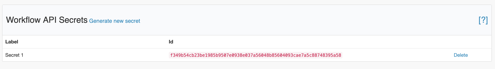

# API Secrets

API secrets are used to call [workflows](./) API. You can manage your API secrets from the dashboard:

Please, be aware that we are not storing secrets in plain text, so you should copy it once created and store it securely on your side.

You should not disclose your secret, and if it's compromised then we recommend to delete it and create a new one.

