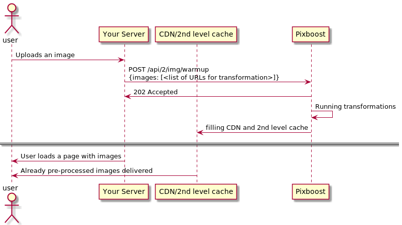

# Warmup

API endpoint - `POST /api/2/img/warmup?auth=[API_SECRET]`

## Description

/warmup performs transformations and caches them, so it will speed up the first response time from the real user.

The typical usecase could be an application where the user can upload images by themselves and then see them once uploaded. The first render could take some time (1-4 seconds) and using `/warmup` will decrease the response time.



The below example will warm up caches for 2 variants of the image:

* [https://pixboost.com/api/2/img/http://www.midday.coffee/banner.jpeg/resize?size=x100\&auth=ABCDEF](https://pixboost.com/api/2/img/http://www.midday.coffee/banner.jpeg/resize?size=x100\&auth=ABCDEF)
* [https://pixboost.com/api/2/img/http://www.midday.coffee/banner.jpeg/resize?fit=100x100\&auth=ABCDEF](https://pixboost.com/api/2/img/http://www.midday.coffee/banner.jpeg/resize?fit=100x100\&auth=ABCDEF)

The URLs of the images to warm up should be exact the same you use in your FrontEnd implementation.

```bash
curl -X POST -H 'Content-Type: application/json' \ 
    'https://pixboost.com/api/2/img/warmup?auth=ABCDEF' \
    -d '{"images: ["https://pixboost.com/api/2/img/http://www.midday.coffee/banner.jpeg/resize?size=x100&auth=ABCDEF","https://pixboost.com/api/2/img/http://www.midday.coffee/banner.jpeg/resize?fit=100x100&auth=ABCDEF"]}'
```

## Parameters

API\_SECRET - [secret key](api-secrets.md).

## Response

202 - The warmup has been successfully initiated.

## Example

You can find reference example of using cache invalidation workflow with S3 bucket [here](https://github.com/Pixboost/aws-s3-invalidate-cdn). You can replace cache invalidation call with `/warmup` in Lambda.

## Limitations

Maximum number of images to warmup in one call is 20. This is a soft limit and could be increased on request.
